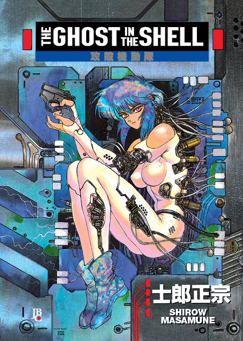
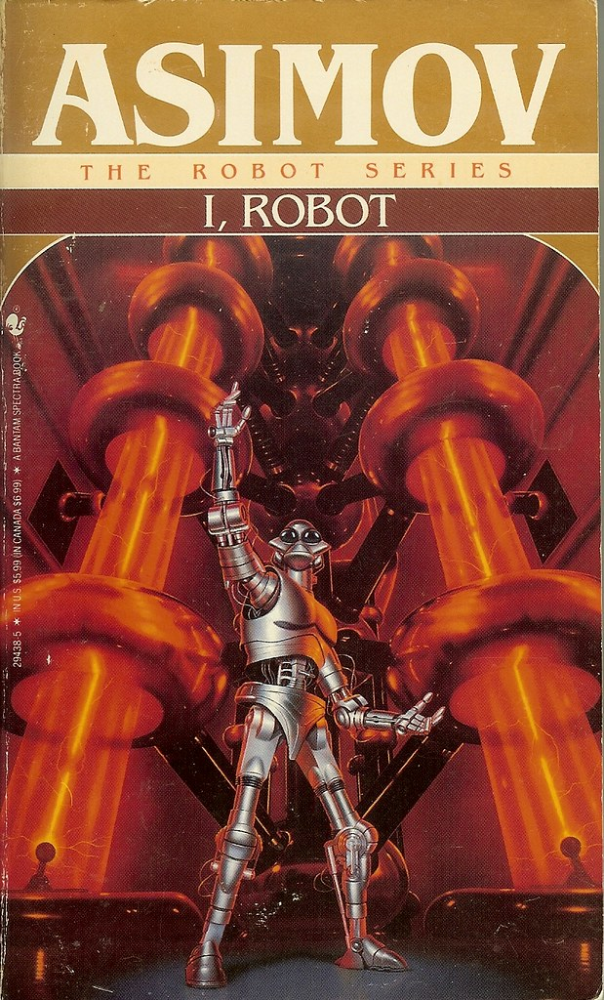
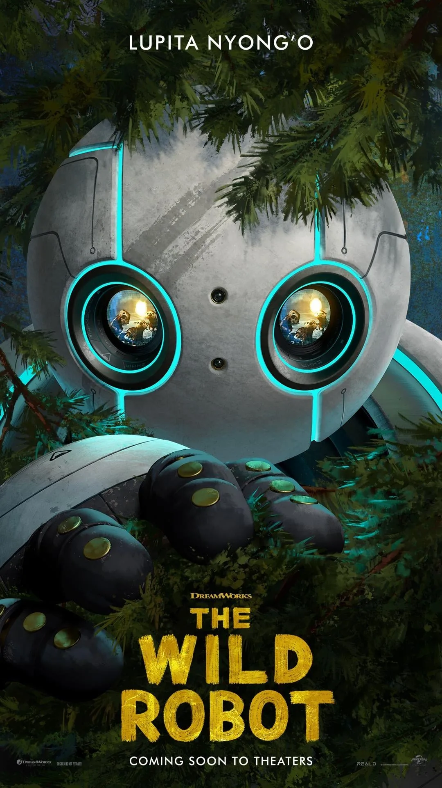

```{r setup, include = FALSE}
library(tidyverse)

actor_shell <- function(fn, wo) {
  force(fn)
  force(wo)
  function(w, flip = FALSE, other = "") {
    w <- ifelse(missing(w), wo, w)
    glue::glue('')
  }
}

gigante <- actor_shell("gigante.svg", "100px")
girl <- actor_shell("cyberpunk1.svg", "120px")
minirobot <- actor_shell("robot3.svg", "100px")
tech <- actor_shell("robot4.svg", "220px")
robot_militar <- actor_shell("robot5.svg", "100px")
robot_walle <- actor_shell("walle.svg", "100px")
robot_k2 <- actor_shell("k2.svg", "100px")
bd1 <- actor_shell("bd1.svg", "120px")

asimo <- actor_shell("asimo.svg", "120px")
atlas <- actor_shell("atlas.svg", "120px")
ur <- actor_shell("ur.svg", "120px")
kuka <- actor_shell("kuka.svg", "120px")
boston <- actor_shell("boston.svg", "120px")
noa <- actor_shell("noa.svg", "120px")

rotating_text <- function(x, align = "center") {
  glue::glue('
<div style="overflow: hidden; height: 1.2em;">
<ul class="content__container__list {align}" style="text-align: {align}">
<li class="content__container__list__item">{x[1]}</li>
<li class="content__container__list__item">{x[2]}</li>
<li class="content__container__list__item">{x[3]}</li>
<li class="content__container__list__item">{x[4]}</li>
</ul>
</div>')
}

fa_list <- function(x, incremental = FALSE) {
  icons <- names(x)
  fragment <- ifelse(incremental, "fragment", "")
  items <- glue::glue('<li class="{fragment}"><span class="fa-li"><i class="{icons}"></i></span> {x}</li>')
  paste('<ul class="fa-ul">', 
        paste(items, collapse = "\n"),
        "</ul>", sep = "\n")
}

```

# [`r rmarkdown::metadata$pagetitle`]{.monash-blue} {#title-slide background-image="images/robot_cover.svg"}


<br>

<h2>`r rmarkdown::metadata$subtitle`</h2>

::: {.bottom_abs .width100}

Student: *`r rmarkdown::metadata$author`*

<i class="fas fa-university"></i> `r rmarkdown::metadata$department`, <Br>&nbsp;&nbsp;&nbsp;&nbsp;&nbsp;`r rmarkdown::metadata$institute`, Madrid

<i class="fas fa-envelope"></i>  `r rmarkdown::metadata$email`

<!-- <a href="https://twitter.com/" style="color:black"><i class="fab fa-twitter"></i> @statsgen</a> -->

<i class="fas fa-calendar-alt"></i> `r rmarkdown::metadata$date`

:::

## [Key ideas]{.monash-blue}

::: {.flex .justify-around}
::: w-30

:::

::: w-30

:::

::: w-30

:::

:::

::: {.flex .small}
::: w-30
*What if a cyber brain could possibly generate its own ghost, and create a soul all by itself? -- Motoko Kusanagi*
:::

::: w-30
*I’m sorry, but you don’t understand. These are robots -- and that means they are reasoning beings. They recognize the Master, ... They call me the prophet -- Cutie (QT-1 robot)*
:::

::: w-30
*Can I be his mother? -- Roz*
:::

:::


# [What does `intelligence` mean in robotics?]{.strokeme} {.monash-bg-pink2}


## {auto-animate=false}

::: {.fragment .fade-up fragment-index=1}
<h2>A draft [meaning]{.monash-blue2} </h2>
:::

::: flex

::: w-20
`r gigante(w = "200px")`
:::

::: w-80 
<Br><br>

::: f3
`r rotating_text(c('[**Self-driving** is part of an autonomous car?]{.speech}', '[The amazon robots can **transport** all my purchases]{.speech}', '[**Exploring** the surface of an unknown planet is difficult?]{.speech}', '[Surgical robots learn how to interact with patients]{.speech}'), align = 'left!important')`
:::


<br><br> 

::: {.fragment .fade-up fragment-index=1}
The ability to [**learn**]{.monash-blue2} from its surroundings and previous experiences by performing specific tasks with or without human intervention in a [**unknown and complex situations**]{.monash-blue2}.
:::

:::

:::

::: {.absolute .bottom-0 .f5}
<!-- A draw of a robot generated with AI in <a href="https://www.freepik.es/">Freepik</a> -->
:::


## Should a robot be [intelligent]{.monash-ruby2}? {auto-animate=true}

::: flex


::: w-80 

[**Yes**, they're becoming more and more intelligent !!!]{.speech .f3 .fr}

<br>

<div class="fat-diet">Why?</div>

`r fa_list(c("fa-solid fa-spinner fa-pulse" = "Being an autonomous robot also demands a way of learning and a self-improvement in making decision", "fa-solid fa-user-slash fa-beat" = "To work with humans in a more natural, safety and collaborative environment"), incremental = FALSE)`

:::

::: w-20

`r girl(w = "100%")`

:::

:::

::: {.absolute .bottom-0 .f5}

:::

## Should a robot be [autonomous]{.monash-ruby2}? {auto-animate=true}

::: flex

::: w-80 

[**Yes**, they're becoming more and more intelligent !!!]{.speech .f3 .fr}

<br>

<div class="fat-diet">Why?</div>
<div class="control-diet" data-id="trt1">How?</div>

`r fa_list(c("fa-solid fa-gear fa-spin" = "By including perception (such as vision and haptic sensors), object manipulability, recognition and processing systems capabilities., ", "fa-solid fa-robot fa-bounce" = "Today, Artificial Intelligence can help robots to deal with unexpected situations."), incremental = FALSE)`
:::

::: w-20

`r girl(w = "100%")`

:::

:::

::: {.absolute .bottom-0 .f5}

:::

## [Why we should [**treat robotic intelligence**]{.monash-ruby2} differently?]{auto-animate=true}

::: flex

::: {.w-60 .r-fit-text}
- Robotics intelligence involves multiples dimensions compared to AI systems in purely digital environments.
- We expect robot  have to:  
  - Perceive their surroundings  
  - Interpret data  
  - Act on their decisions by **physically moving**

- Errors in this actions require **fail-safe systems, ethical guidelines, and real-time robustness**
:::

::: w-40
`r robot_walle(w = "400px")`
:::

:::

## [How Much Intelligence Should Be **Regularized**?]{auto-animate=true}
Robots require a balance innovation in 

::: {.small}
::: {.callout-note title="Autonomous decision-making"}
Interact with humans or operate in public places
:::

::: {.callout-note title="Ethical decision-making"}
Ensuring that their actions align with human values
:::

::: {.callout-note title="Human supervisio"}
Maintain a level of human oversight over robotic decision-making
:::
:::


# [Commercial robots today]{.monash-blue2}{.bg-green} 

## Intelligence vs Autonomy {auto-animate=true}

::: {.flex}

::: w-30


*Sci-fi robots* vs *Modern robots*

:::

::: w-70

:::

:::


# {background-image="images/walle-fondo.svg"}
<!-- {.absolute top=30 right=0 width="400" height="800"} -->
<br>
<br>
<br>
<br>

::: {.bottom_abs style="font-size:24pt;"}
`r fa_list(c("fa-solid fa-link" = "[Slides](https://jacobozavaleta.quarto.pub/s10_introrobots/#/title-slide) based on [emitanaka.org/slides/Ihaka2022/](https://emitanaka.org/slides/Ihaka2022/)", "fa-brands fa-r-project" = '<i class="fa-solid fa-terminal"></i> Created with <code>Quarto</code>', "fa-solid fa-envelope" = "[sergioaugustoantenor.jacobo@alumnos.uc3m.es](mailto:sergioaugustoantenor.jacobo@alumnos.uc3m.es)"))`
:::
